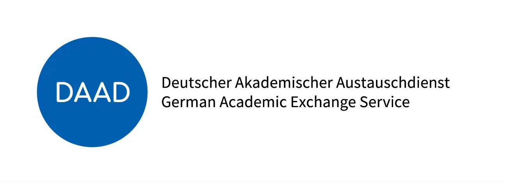

<!--

author:   Andreas Heil
email:    andreas.heil@hs-heilbronn.de
version:  0.2
language: en
narrator: EN German Male

comment: 

-->

 

# Cloud Computing - COIL

These pages are also available as als [interaktive course](https://liascript.github.io/course/?https://github.com/aheil/c2c2) .

**About the course**

This course page is part of the COIL Course Cloud Computing of the master course [Software Engineering Master (SEM)](https://www.hs-heilbronn.de/en/sem) at the [University of Applied Sciences in Heilbronn](https://www.hs-heilbronn.de/en) in Heilbronn, Germany, as well as the [Business Information Systems (BIS)](https://vgu.edu.vn/study-programs/master/bis) of the [Vietnamese Germany University](https://vgu.edu.vn/) in Ho Chi Minh City, Vietnam as part of the [COIL and Virtual Exchange program](https://www.hs-heilbronn.de/en/coil-and-virtual-exchange-40524c66c91530b5) at Heilbronn University of Applied Sciences. 

The goal is to develop a solution that is as holistic as possible. This includes the practical construction of a physical single-board computer cluster, which will be set up and put into operation as part of a joint exchange of students.

After this joint prelude, the students switch to collaborative online mode and design and install the software landscape for the administration, monitoring and operation of the built cloud platform, on which software developed by the course participants themselves is operated at the end of the project. The intercultural and geographically distributed environment will prepare the students for a real project environment.

This course page provides all companion material and results of the course. 

Funded by

[<!-- style="width: 50%;" -->](https://www.bmbf.de/bmbf/en/)

[<!-- style="width: 50%;" -->](https://www.daad.de/en/)

## Course Information 

This course takes places during the winter term 2022/2023 aw replacement of the regular Cloud Computing course. 

The course is limited to 15 BIS students as well as 15 SEM students and will will take place from the 24th to the 28th October 2022.

For students of this course, an [ILIAS room](https://ilias.hs-heilbronn.de/goto.php?target=crs_360705&client_id=iliashhn) as well as a [Git Repository](https://git.it.hs-heilbronn.de) is available. 

**Lecturers and advisors**

Prof. Andreas Heil (HHN), Dr. Dinh Hai Dung (VGU), Dr. Tran Duc Khanh (VGU) 

**Course Cumber**

172369 Cloud Computing (SEM/SPO2)

**Level**

Master

**Hours/ECTS**

2/3

**Workload**

- 30h Contact Hours
- 90h Self studies and project work 

**Course times** 

* Project Week (24th - 28th October 2022)
* Project Work (flexible time management)

**Assessment**

There is no exam in this course. The course members will be graded based on their individual as well as their groups contribution.

Total of 100 points.

| Activity | Points | 
| --- | --- |
| Project Week Results | 30 |
| Group Presentation | 10 |
| Documentation | 20 |
| Final Product  | 30 |
| Final Presentation | 10 |

Grading according to the German grading policy for tertiary education.

|**Points**|<40|43|50|57|65|70.5|76|80|83|87|90|>94|
|**Grade**|5.0|4.7|4.0|3.7|3.3|3.0|2.7|2.3|2.0|1.7|1.3|1.0|

**Submissions**

All course based code ha to be submitted to GitLab at [https://gitlab.it.hs-heilbronn.de](https://gitlab.it.hs-heilbronn.de).

The project documentation has to be provided via the [student confluence in the c2c2 space](https://confluence-student.it.hs-heilbronn.de/display/C2C2).

**License**

If not stated otherwise, all material on this course page is  [Creative Commons Namensnennung 4.0 International Lizenz](https://creativecommons.org/licenses/by/4.0/). 

## Schedule 

**Project Week**

||Monday (23.10.)|Tuesday (24.10.)|Wednesday (25.10.)|Thursday (27.10.)|Friday (28.10)|Saturday (29.10.)|Sunday (30.10.)|
|-|-|-|-|-|-|-|-|
| | Breakfast at hostel | Breakfast at hostel | Breakfast at hostel | Breakfast at hostel | Breakfast at hostel | Breakfast at hostel | Breakfast at hostel |
| | Commuting to University )| Commuting to University | Commuting to University | Commuting to University | Commuting to University | Free Time / Individual Excursion | Departure |
| | Arrival in Sontheim | Arrival in Sontheim | Arrival in Sontheim | Arrival in Sontheim | Arrival in Sontheim | ... | ... |
|09:30-10:00|Arrival Sontheim | Arrival Sontheim, Come together in your groups|Arrival Sontheim, Come together in your groups|Arrival Sontheim, Come together in your groups|Arrival Sontheim, Come together in your groups|...|...|
|10:00-11:00|Reception / Organisational / Travel expanses (Room:G218)| Introduction Hard and Software workshop (Room: Y110)|Kubernetes Workshop Workshop Exxeta AG (Room: G218)|Introduction Virtual COIL Group Work during semester (Room: Y108)|Group Presentations (Room: Y108)|...|...|
|11:00-12:00|Intercultural Workshop (Room: Sportlerheim)| Hard- and Software Workshop (group spaces at campus)|...|...|...|...|...|
|12:00-13:00|Intercultural Workshop (Room: Sportlerheim)|...|...|Group Work, Project Design (Room: Y108)|Lunch, Guest Cards! (Room: Mensa)|||
|13:00-14:00|Lunch, Guest Cards (Room: Mensa)|Lunch (Room: Mensa)|Lunch (Room: Mensa)|Lunch (Room: Mensa)|Travelling Downtown HN|...|...|
|14:00-15:00|Intercultural Workshop (Assigned Rooms: E205, F229, E116, E217, E216, E207)|Hard- and Software Workshop (group spaces at campus)|Kubernetes Workshop Workshop Exxeta AG (Room: G218)|Lecture Modern Software Development and the possibilities of the Cloud, Bechtel AG (Room: Y108)|Visiting Experimenta Exhibition Heilbronn|||
|15:00-16:00|...|...|...|...|...|...|...|
|16:00-17:00|...|...|...|Group Work, preparing presentations|...|...|...|
|17:00-18:00|...|...|Free time for your groups|...|Free time for your groups|...|...|
|18:00 - End | Free time for your groups|Free time for your groups| ... |Free time for your groups, preparing presentations|...|...|...|

## Project Week 

### Day 1 

During the first day a intercultural workshop took place, where the members of the team had plenty of time to get to know each other.

Further information on this will follow soon...
### Day 2 

Day two is fully packed with technical challenges, where the teams are going to finish various tasks.

The tasks will be done by 

- a **hardware team** where we build our own cloud based on a RaspberryPi cluster
- a **Linux team** responsible for the base system, hardening the base system and including everything in the Ansible scrips
- a **Kubernetes team**, responsible to install a Kubernetes base installation
- an **Ansible team**, responsible for creating automated tasks to set up the cluster (operating system, security, installing the Kubernetes on the cluster) and 
- setting up a CI/CD pipeline by a *automation team* so everything the team creates is deployed automatically once checked in in Git.

For all teams, the three part guide [Kubernetes Cluster on Raspberry Pi 4B](https://www.reddit.com/r/kubernetes/comments/enojpn/step_by_stepguide_kubernetes_cluster_on_raspberry/)  might be a good starting point: 

- https://www.reddit.com/r/kubernetes/comments/enojpn/step_by_stepguide_kubernetes_cluster_on_raspberry/

Part 1:

- https://medium.com/@astrujic/step-by-step-slow-guide-kubernetes-cluster-on-raspberry-pi-4b-part-1-6e4179c89cbc

Part 2:

- https://medium.com/@astrujic/step-by-step-slow-guide-kubernetes-cluster-on-raspberry-pi-4b-part-2-e1f2ee8f3011

Part 3:

- https://medium.com/@astrujic/step-by-step-slow-guide-kubernetes-cluster-on-raspberry-pi-4b-part-3-899fc270600e

To get an idea of Kubernetes, check out the [Kubernetes Overview](https://kubernetes.io/docs/concepts/overview/).

- https://kubernetes.io/docs/concepts/overview/ 

Additional information about how to build a Kubernetes cluster on Ubuntu, you find at the Ubuntu tutorials [How to build a Raspberry Pi Kubernetes cluster using MicroK8s
](https://ubuntu.com/tutorials/how-to-kubernetes-cluster-on-raspberry-pi#1-overview).

- https://ubuntu.com/tutorials/how-to-kubernetes-cluster-on-raspberry-pi#1-overview 

The best way to get startet with Ansible is by doing it using the [Ansible Community Documentation](https://docs.ansible.com/ansible_community.html).

- https://docs.ansible.com/ansible_community.html

We do expect at least on Ansible playbook for installing the cluster. Why? As soon as you have finished the playbook, you will be able to install the cluster again, and again, and again within no time. Therefore changing (and messing around) with the cluster won`t hurt. 

Finally, the cluster has to be installed by a [GitLAb CI/CD pipeline](https://docs.gitlab.com/ee/ci/pipelines/).

Setting up the RaspberryPi Case is documented as at the [Cluster Case Assembly Instructions](https://thepihut.com/blogs/raspberry-pi-tutorials/cluster-case-assembly-instructions).

- https://thepihut.com/blogs/raspberry-pi-tutorials/cluster-case-assembly-instructions

Finally, the hardware available for the project is based on the blog of [Rockford Lhotka blog](https://blog.lhotka.net/2020/09/10/Raspberry-Pi-and-microk8s).

- https://blog.lhotka.net/2020/09/10/Raspberry-Pi-and-microk8s

#### Hardware Task 

Tasks:

- Create a Raspberry Cluster based on the hardware provided. The has tobe accessible via the very own wireless adaptor provided.
- Document the setup as well as important decisions so every team member could rebuild the setup

Bonus: The hardware team will join our hardware lab to add some LEDs and flashy lights to our cluster hardware in the afternoon! 

#### Linux Task 

- Set up the base installation for the cluster based on Ubuntu for ARM architecture 
- Take care of hardening the system (no passwords, access via SSH keys only, make sure every team member get s access to the system, firewall. Fail2Ban etc.)
- Prepare every installation step so it can be put into Ansible task for automation 
- Document the setup as well as important decisions so every team member could rebuild the setup

#### Kubernetes Task 

- Set up the basic Kubernetes installation for the cluster. 
- At a minimum one administrator account has to be provided for the following workshop on day 3
- Document the setup as well as important decisions so every team member could rebuild the setup

#### CI/CD Task 

- Set up a CI/CD pipeline in Git.
- After every check-in in git (probably on a very specific branch, e.g. release), the pipeline should be triggered and cause the cluster to be fully installed 
- Document the setup as well as important decisions so every team member could rebuild the setup

### Course Resources

- Confluence for documenting: https://confluence-student.it.hs-heilbronn.de/display/C2C2/c2c2
- HHN GitLab: https://git.it.hs-heilbronn.de (projects will be created as required)
- If not familiar with Git: https://www.udacity.com/course/version-control-with-git--ud123 

### Day 3 

### Day 4

### Day 5

## Project Work 
